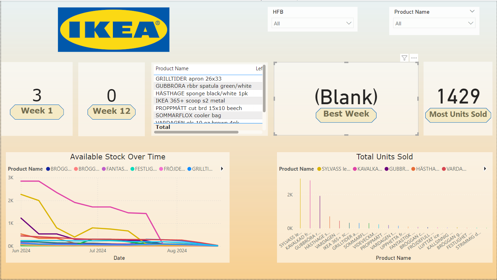
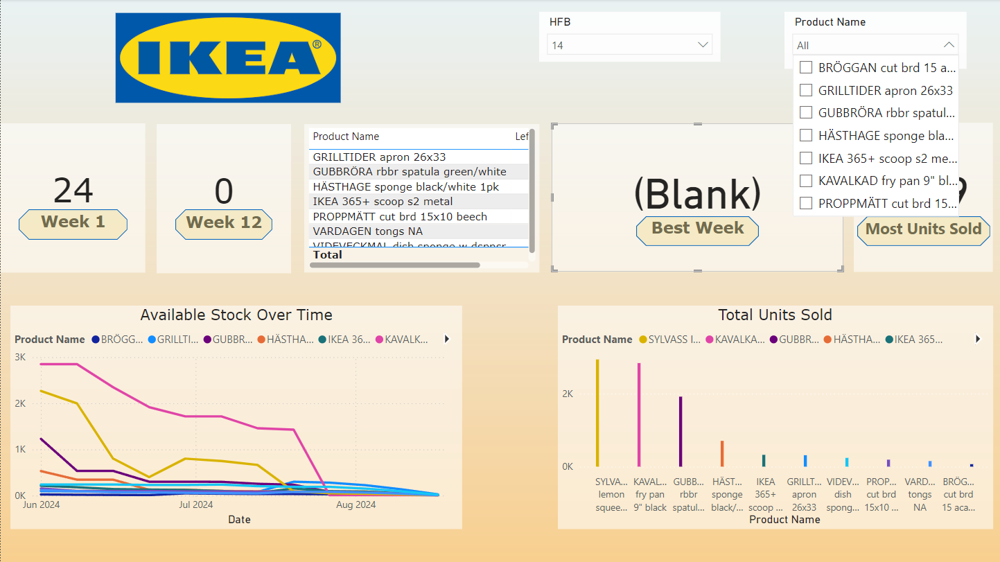
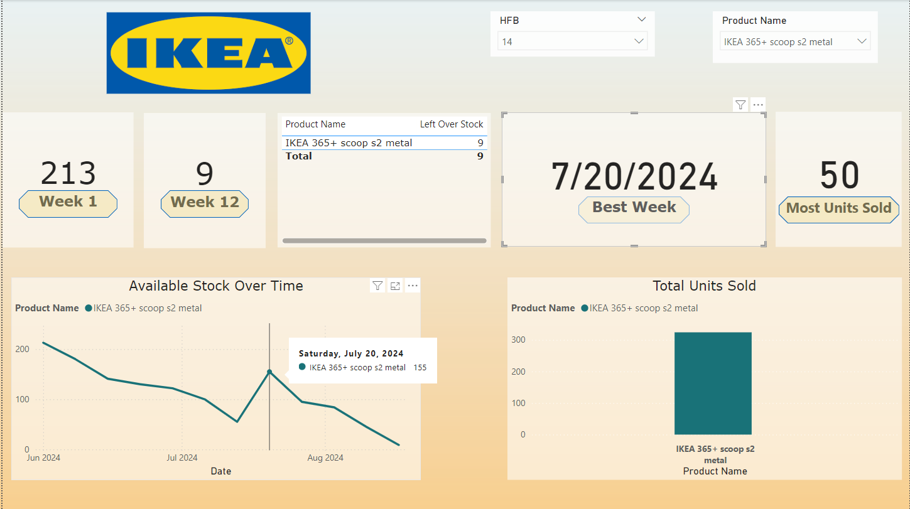

## Introduction

The IKEA Sales Dashboard provides a comprehensive view of sales and inventory performance for various IKEA products over a 12-week period. This dashboard allows users to monitor stock levels, analyze sales trends, and identify key products that performed the best in terms of units sold and stock management. By using interactive visualizations and filters, users can easily explore the data to gain insights into which products sold the most, track stock availability over time, and highlight the top-performing items based on user-defined categories.

## Features

- Visual representation of stock availability over time.
- Key performance indicators (KPIs) showing starting and ending stock, best sales week, and highest units sold.
- Ability to filter by specific products and HFB categories.
- Interactive charts for in-depth sales analysis.

## Technology Stack

- **Power BI**: For data visualization and interactive dashboard creation.
- **Microsoft Excel**: For data storage and manipulation before importing into Power BI.

## Overview of the Sales Dashboard

The IKEA Sales Dashboard provides an interactive way to explore sales and stock information for various products over a 12-week period. The dashboard enables users to analyze stock availability, track the best-selling weeks for individual products, and understand the total units sold for each product. Below is the initial view of the dashboard with slicers for selecting the **HFB** and **Product Name**, along with key metrics like **Week 1 Stock**, **Week 12 Stock**, **Best Week** for sales, and **Most Units Sold**.

## Product Details and Sales Trends

In this section, the dashboard showcases product-specific details such as **Available Stock Over Time** and **Total Units Sold**. Users can select products using the slicers to focus on individual product performance, enabling them to track stock depletion and understand how each product performed over the weeks. The visuals help identify trends in product demand and stock levels.

## Specific Product Analysis

This part of the dashboard allows a more focused analysis on specific products. The **Best Week** and **Most Units Sold** KPIs are highlighted for a selected product, giving insight into the peak sales week and the total number of units sold. The **Available Stock Over Time** and **Total Units Sold** charts provide a visual representation of how stock levels and sales evolved for that product over the 12 weeks.

